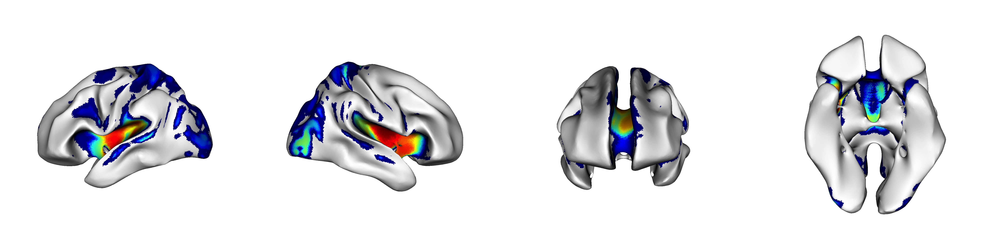
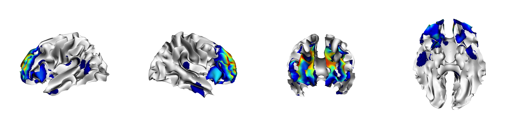

# Comparison with SVD

The reviewer requested a comparison between SyMILR and SVD performed on the same dataset and with analogous study design.  The figures below summarize the omnibus model relationships between the low-dimensional thickness, FA and SNP embeddings produced by SVD and each of the anxiety and depression clinical scores.  Both models produce R$^2$ of 0.23.

\newpage
## SVD-based prediction of anxiety

\newpage
symilr prediction, for comparison:

\newpage
## SVD-based prediction of depression

\newpage

symilr prediction, for comparison:

\newpage
# SyMILR results using pure train/test split in data *without* any clinical scores.

Prediction of MRI-based anatomical measurements from SNPs guided parameter setting in the main paper.  The resulting embeddings were tested for relationships with clinical anxiety and depression measurements.  Although no use of clinical measurements was made during parameter setting, the reviewer requested a second analysis that did not reference any MRI data from the population that contained clinical measurements.  The results, are, overall similar in this second set of analyses to that provided in the main paper.   The figures are below. Model R$^2$ for depression is 0.26 and for anxiety is 0.31.

\newpage
## Supplementary SyMILR-based prediction of anxiety

\newpage
## Supplementary SyMILR-based prediction of depression

\newpage

## Supplementary visualization of embeddings

\newpage

## Selecting an operating point based on reconstruction

We evalute reconstruction error in test data to determine a "best" 
sparseness parameter value for the SNP data.  
Prior selected values were used for neuroanatomical data.
The shaded area was not searched but 
is shown here for completeness.  It was not searched because we 
restricted the parameter domain to sparseness values $\ge 0.5$.
The selected operating point is circled.  The x-axis shows 
sparseness values while the vertical axes are reconstruction errors.

